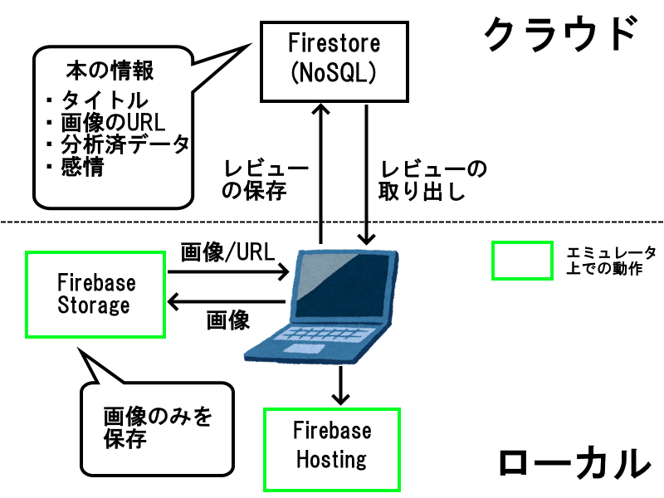

# HackU_3_hunazushi
 限定HackU 2025.3.24-4.5で作成したものです．チームはAさん，Bさん，私の3人です．実際の作業時のリポジトリは以下にあります．  
from https://github.com/hamabu0531/Hack_U_3  
本リポジトリはハッカソン終了後に作成した制作物のマニュアルです．

## アプリケーション概要
画像から書籍を推薦するシステムです．推薦のためには，他のユーザが投稿した画像による書籍に対するレビューを使用します．テキストではなく画像を使用することで，短時間で直感的に本の特徴をつかむことができます．  
短期間の開発であるためFirebase，JavaScriptを使用しました．

### アプリケーション構成図
アプリケーションの構成図を以下に示します（Aさん作成）．


### 画像スコア算出
推薦時に使用する各画像のスコア計算の模式図を以下に示します（shimooo3作成）．単純なRGB値の計算により実装しました．  


## 動作イメージ
発表時に使用したデモ動画です．

https://github.com/user-attachments/assets/6dc94efd-4e70-4e3a-8bdc-40c92208dbe9

## 環境構築
### Firebaseの設定
Firebase初期化時に以下を選択してください.
- Hosting
- Firestore
- Storage
- Emulators

### ローカル起動
起動時はFirebaseのコンフィグを./public/js/のファイルに記述してください．
- functions.js
- graph.js
- review-posting.js
- script.js

StorageのみEmulatorを使用して起動します．ターミナルを2つ起動し，それぞれで以下を実行してください．
```
$ firebase emulators:start --only storage
$ firebase serve
```

以上
